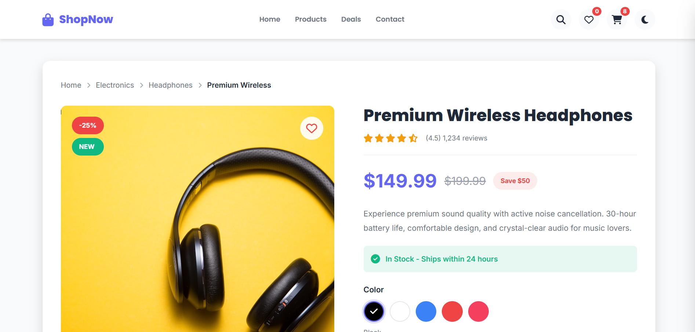
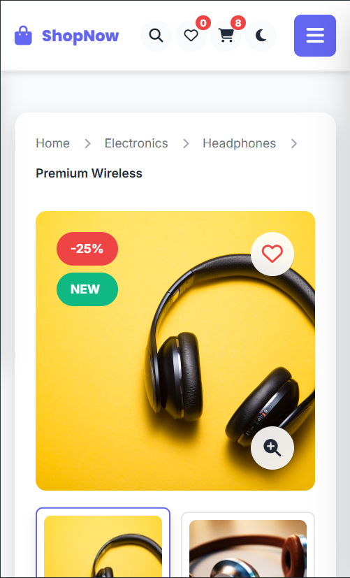

# 🎧 Headphones E-Commerce Product Page (v1)

A modern and responsive **e-commerce product page** designed for showcasing headphones with interactive UI and dynamic cart functionality using JavaScript.

---

## ✨ Overview

This project focuses on building a **real-world product page experience**, combining clean UI design with interactive features such as product selection, quantity management, and cart handling.

---

## 🚀 Features

* Responsive design across all devices
* Interactive product image gallery
* Add to cart functionality
* Increase / decrease product quantity
* Dynamic price updates
* Smooth UI interactions

---

## 🛠️ Tech Stack

* HTML5
* CSS3
* JavaScript

---

## 📸 Preview

### 💻 Desktop View

### 📱 Mobile View

---

## 🌍 Live Demo

https://omkarghare8803.github.io/ecommerce-product-page-v1/

---

## 📌 Version

**v1.0** — Initial release

---

## 🔮 Future Improvements

* Persistent cart using localStorage
* Product variants (color / size selection)
* Dark mode support 🌙
* Improved animations and micro-interactions
* Multi-product support

---

## 👨‍💻 Author

**Omkar R. Ghare**
Front-End Developer

---

## 📜 License

This project is open-source and available for learning and personal use.
